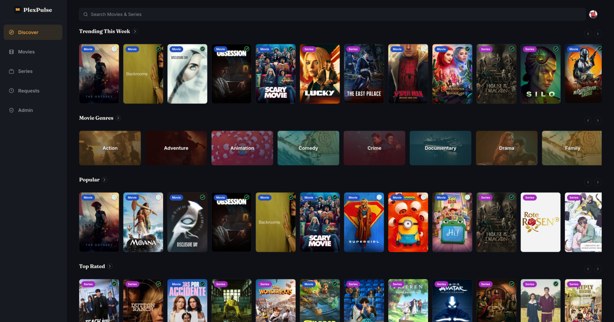
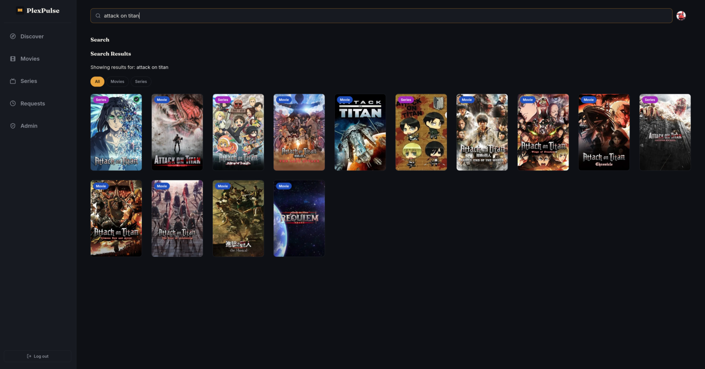
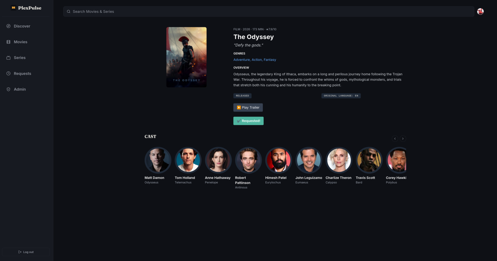
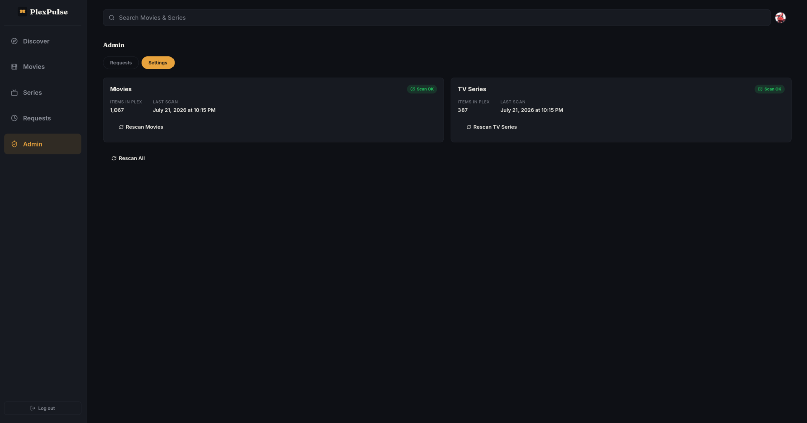

# PlexPulse

A self-hosted media discovery and request app for your Plex server, built with Next.js 14. Browse trending, popular, and top-rated movies/TV, search with live results as you type, and request titles directly to your Plex watchlist — with real-time status tracking (Requested / Available) checked against your actual Radarr, Sonarr, and Plex library.

## Features

- **Plex OAuth login** — PIN-based, no password entry
- **Browse content** — trending, popular, top-rated, and upcoming movies/series
- **Genre browsing** — with real backdrop artwork
- **Infinite scroll** — on every list
- **Live search** — results as you type across movies, TV shows, and people
- **One-click requests** — adds titles to your Plex watchlist automatically
- **Real-time status tracking** — "Requested" or "Available" checked against Radarr, Sonarr, and your Plex library
- **Webhook fast-path** — Radarr/Sonarr notify PlexPulse instantly when imports complete (see SETUP.md)
- **Request history** — "Requests" tab showing all your submitted requests
- **Admin dashboard** — view every user's request history, manually rescan movies and series, and rescan all media at once
- **Admin settings** — dedicated settings tab with rescan controls
- **Automatic daily scans** — keeps "Available" status accurate without manual refreshes
- **Fully responsive** — dedicated mobile layout with bottom navigation
- **User profiles** — click the Plex avatar in the header to access the admin dashboard (if you have admin access)

## How It Works

```
Request in PlexPulse
        │
        ▼
Added to your Plex Watchlist
        │
        ▼
Detected by Pulsarr
        │
        ▼
Routed to Radarr / Sonarr
        │
        ▼
PlexPulse status updates: Requested → Available
```

**Note:** Pulsarr, Radarr, and Sonarr are **required** for PlexPulse to work. Without them:
- PlexPulse cannot route requests to download services
- Status tracking (Requested/Available) won't function properly

Learn more about Pulsarr at https://github.com/jamcalli/pulsarr — it's the bridge between your Plex watchlist and download managers.

## Screenshots

**Dashboard** — trending, popular, and top-rated shelves at a glance


**Live search** — results as you type, across movies, TV shows, and people


**Detail page** — cast, trailer, and one-click request


**Admin panel** — every user's request history in one place


## Tech Stack

Next.js 14 (App Router), TypeScript, Tailwind CSS, Drizzle ORM with libSQL (SQLite), Redis, TMDB API, Plex API, Radarr/Sonarr APIs.

## Prerequisites

Before you start, make sure you have:

- **Plex Media Server** (v1.32 or later) — running and accessible on your local network
- **TMDB API key** (free) — get one at https://www.themoviedb.org/settings/api
- **Radarr** — for movie request routing and status tracking
- **Sonarr** — for TV series request routing and status tracking
- **Pulsarr** — for automatic watchlist-to-Radarr/Sonarr routing (see https://github.com/jamcalli/pulsarr)
- **Docker** or **Docker Compose** (if using the container deployment options below)

## Quick Start

For copy-paste setup instructions (Docker Compose, Unraid, or manual Docker), see **[QUICKSTART.md](./QUICKSTART.md)**.

For detailed configuration, environment variables, and troubleshooting, see **[SETUP.md](./SETUP.md)**.

## What's Next?

Once PlexPulse is running:

1. **Log in with Plex** — use your Plex PIN (no password required)
2. **Browse and search** — explore trending/popular content
3. **Request titles** — click the request button; titles are added to your Plex watchlist
4. **Monitor requests** — check the "Requests" tab to see your submission history
5. **Verify Pulsarr routing** — confirm that watchlist items are being routed to Radarr/Sonarr (see Pulsarr docs at https://github.com/jamcalli/pulsarr)
6. **(Admin only) Manage and rescan** — click your Plex avatar to access the admin dashboard and manually trigger library rescans if needed

## Security

Since PlexPulse handles Plex auth tokens and talks to your Radarr/Sonarr/Plex instances, it's had a dedicated hardening pass:

- Origin validation on state-changing requests (watchlist adds)
- OAuth callback postMessage locked to your app's origin, not broadcast wildcard
- Nonce-based CSRF protection with one-time-use replay protection
- Redis-backed rate limiting (fails open on Redis outage)
- Encrypted session storage with legacy-format back-compat
- Redis requires a password (`--requirepass`) rather than running open
- Comprehensive test suite (`npm run test`) covering all of the above

See [AGENTS.md](./AGENTS.md) for the full technical details and known gotchas.

## Acknowledgments

- [Seerr](https://github.com/seerr-team/seerr) (formerly Overseerr) — design and feature inspiration
- [TMDB](https://www.themoviedb.org/) — movie/TV metadata and artwork
- [Plex](https://www.plex.tv/) — media server and watchlist integration
- [Radarr](https://radarr.video/) / [Sonarr](https://sonarr.tv/) — status tracking for your requests
- [Pulsarr](https://github.com/jamcalli/pulsarr) — watches the Plex watchlist and routes requests to Radarr/Sonarr

## License

MIT License — see [LICENSE](./LICENSE) file.

---

## For Developers

- **Project context & architecture:** See [AGENTS.md](./AGENTS.md)
- **Security details & known bugs:** See [AGENTS.md](./AGENTS.md) "Known Gotchas" section
- **Contributing:** Open an issue or PR with your ideas
